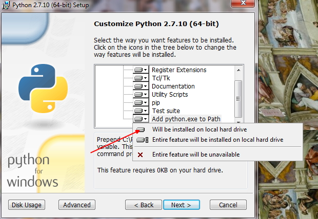

# Python学习日记

# 第一日 环境配置
因为在win7环境下安装了centos的虚拟机，所以打算在linux环境下进行python学习。  
第一步就是在centos中安装和配置python。  
因为centos自带最新版本python，所以只需要下载一个IDE，我选择的是eclipse。  
参考：http://www.linuxidc.com/Linux/2015-01/111444.htm  

不过我又放弃了，决定现在windows下入门：）  

# Win7（64位）下安装python2.7
1. 先上官网下载windows64位安装版  
众多版本中选择：Windows x86-64 MSI installer  
  
2. 默认安装，选择组建时，将最后一项：add python.exe to   Path选中，自动将python目录添加到环境变量中。  
3. 再下一步安装，完成。  
测试是否安装成功  
打开cmd命令行窗口，输入python，回车。如下：  
  
成功安装，然后按ctrl+z，回车。退出python的shell模式。  

# 安装IDE编程工具
虽然python自带IDE，不过还是想试试别的。  
## Editplus  
最熟悉的就是Editplus，下载了V4.0破解版。直接编辑，目前怎么运行还不知道。  
### 配置Editplus
参考：http://it.chinawin.net/softwaredev/article-162c6.html  

## Eclipse
Eclipse 非常强大，据说复杂工程用它来开发都ok了。我只是想提前适应下，不过入门主要还是考Editplus吧~  
参考：http://www.cnblogs.com/Bonker/p/3584707.html  


# 第二日 基础语法学习
## 导入py文件（即“导入模块”）  
`import Mod`   
这句话代表导入同文件夹下的Mod.py  
`from Mod import str`  
这句话是代表仅仅导入Mod.py中的str变量或对象  
在导入后引用时，可以直接引用str，或者更好的习惯是这种清晰的引用：  
`print(Mod.str)`   

## 全局变量
在函数外围定义的变量都是全局变量。不过在函数内部调用全局变量时，不能直接用。  
`global str`  
需要这样写一句，才能其后进行调用  

## for…in range() 循环
典型的此循环语句是这样：  
` for i in range(x,y,z) `  
主要新鲜的是`range(start, stop, step)`函数，它返回的是一个数列，其中：  
start是起始数值（包括），stop是结束数值（不包括），step是递进大小
如` range(5,-1,-1) `返回的数列是`[5,4,3,2,1,0]`  
   `range(0,5)` 返回的是`[0,1,2,3,4]`  
   `range(5)`返回的是数列`[0,1,2,3,4]`，也就是说：`range(n)` == `range(0,n)`  

## break和continue
两者都用于中断循环，但区别是：  
-	break直接停止循环，相当于exit  
-	continue不停止循环，只跳过后面的语句，继续下一个遍历  

## 取模和求幂  
-	x%y 表示取模运算，即对x÷y取余数  
-	x**y 表示求幂运算，即x的y次方  

## 运算优先级
`关系运算符` 优先于`逻辑运算符`；`(括号)`优先于所有符号
-	关系运算符是：`＋-×÷%`等
-	逻辑运算符是：`and` / `or` / `not`

## 冒泡排序算法
比传统遍历好多了，也算基础中的基础，我好像好多年前学过不过竟然忘了。。。
在python中代码是这样的：  
  
原理很简单，从第1个数开始，对比相邻的2个数，然后数大的排在数小的后面（也就是两者交换位置）；一直到最后一个数位置，这样最大的数就沉淀到最后了；再从头开始比较，只是这次就不需要比较最后一个数了；然后再下一轮比较，再排除最后…   
放到python语言中实现，利用2个循环嵌套：外循环控制对比的范围，逐渐缩小范围（-1），内循环才是在范围内逐个进行相邻数比较。  

## 切片序列
在所有可以归为序列的变量中，如数组、元组、字典甚至字符串，都可以用到切片序列这个方法，极其方便。  
切片序列的语法如下：  
`Sequence[start:end:step]`  
有点像range()。先说个比较常用的案例吧。  
### 字符串反转
实现字符串从头到尾颠倒反转，有很多种方法： 
1. 循环   
2. str转为列表后反转列表  
3. 切片序列  
其中最为简单的就是切片序列的用法，只要一句话：  
`s[::-1]`
如果`s="hello"`那么结果就是"olleh"  
也就是说，切片序列的start,end参数为空，则默认按照step的逻辑开始执行。再如：  
`range(10)[::2]`  
得到的就是：[0,2,4,6,8]这样每隔2的数。
当然还可以这样 ：  
`range(100)[20:10:-2]`  
得到的就是：[20, 18, 16, 14, 12]

# 第三日 
发现Editplus不支持交互，eclipse对配置要求太高一打开就卡，然后听说有sublime，就安装了sublime text2试试。  
## Sublime Text2 安装配置
### 配置python  
参考：https://www.youtube.com/watch?v=6ZpuwW-9T54  
这个视频教程极其简单，比网上中文文章清晰多了。  
直接打开菜单`Prefrences – Browse Package`，打开了一个文件夹，找到Python文件夹，里面的`Python.sublime-build`文件，打开编辑，将cmd参数的值Python改为：  
`C:\\Python27\\python.exe`
即当前系统python.exe的所在位置，用双斜线。保存。
打开py文件，在Tools菜单下Build System中选择python,就可以了。
然后按下`ctrl+B`直接编译。

### 如何安装插件
首先需要安装`Package control`控制器。  
参考：https://packagecontrol.io/installation#st2  
打开菜单`View – show console`控制台，输入：  
```
import urllib2,os,hashlib; h = 'eb2297e1a458f27d836c04bb0cbaf282' + 'd0e7a3098092775ccb37ca9d6b2e4b7d'; pf = 'Package Control.sublime-package'; ipp = sublime.installed_packages_path(); os.makedirs( ipp ) if not os.path.exists(ipp) else None; urllib2.install_opener( urllib2.build_opener( urllib2.ProxyHandler()) ); by = urllib2.urlopen( 'http://packagecontrol.io/' + pf.replace(' ', '%20')).read(); dh = hashlib.sha256(by).hexdigest(); open( os.path.join( ipp, pf), 'wb' ).write(by) if dh == h else None; print('Error validating download (got %s instead of %s), please try manual install' % (dh, h) if dh != h else 'Please restart Sublime Text to finish installation')
```  
回车，安装成功，重启软件。然后再Prefrences 菜单下就看到Package Control菜单了。启动它的快捷键是：`ctrl+shift+P`  
安装插件的方法是：启动package control，输入`install`   package，弹出了选择插件的菜单，输入想要的插件名，点击，等待安装（下方状态栏中有显示），安装成功！  

### 好用的插件
参考：https://dbader.org/blog/setting-up-sublime-text-for-python-development  
`SublimeREPL`：用于运行和调试一些需要交互的程序（E.G. 使用了Input()的程序）  
`CodeIntel`：自动补全+成员/方法提示（强烈推荐）  
`Bracket Highlighter`：括号匹配及高亮  
`SublimeLinter`：代码pep8格式检查  

## 遇到pylinter错误  
重启sb2时候，打不开了，说是pylinter这个插件出错。。。于是找到了解决方案：  
参考：http://blog.csdn.net/jiangxuchen/article/details/42212387  
首先打开  
首先从https://pypi.python.org/pypi/pylint 下载pylint   解压至某目录，如：`C:\pylint-1.0.0`  
进入`C:\Users\administrator\AppData\Roaming\Sublime Text 2\Packages\Pylinter`，修改目录下的`Pylinter.sublime-settings`的文件。设置`pylint_path`变量，指定pylint的位置，`"pylint_path": "C:/pylint-1.0.0"` ，需要特别注意盘符后面的是"/"

### 解决sublime调用python的input函数交互问题
参考：http://blog.chinaunix.net/uid-12014716-id-4269991.html  
安装sublimeRepl后，直接`ctrl+b`是不能运行的，必须要点开菜单`tools – sublimeRepl – python – run current file` 才行。点开后，会弹出一个新界面，在那里进行交互。然后为这个麻烦的菜单选择创建一个快捷键（比如F5）：  
`perferences -- key bindings user` 中粘贴如下代码：
```
[ {"keys":["f5"],
"caption": "SublimeREPL: Python - RUN current file",
"command": "run_existing_window_command", "args":
{
"id": "repl_python_run",
"file": "config/Python/Main.sublime-menu"
}}
]
```
保存，打开py文件，按F5，成功！  
不过两个页面来回跳也麻烦，于是有了双屏方案：  
`alt+shift+2`，如果屏幕够大，可以`alt+shift+3`或4/5/6，随便了。

### 卸载插件
调用·package control· ，输入package control: remove package，   弹出菜单后，输入要删的插件，回车，等待，完成。  

# 第四日 连接数据库
## 使用DAO对象访问数据库
因为想用最简单的方式先连一下数据库试试，所以数据库用的Access，连接方式用的不需要配置ODBC、只需要输入数据库文件地址的方式DAO（Data Access Object）。    
## win32com.client模块出错  
第一句：import win32com.client就出错了，说找不到。于是上网下载相应python版本的win32扩展。地址是：http://sourceforge.net/projects/pywin32/files/pywin32/   
进去以后选择最新的文件夹，然后选择·pywin32-219.win-amd64-py2.7·下载。因为我的python版本是2.7，然后我是64位的，所以选这个。虽然不知道amd和我有什么关系吧。但是安装成功了，直接运行程序，问题解决。


